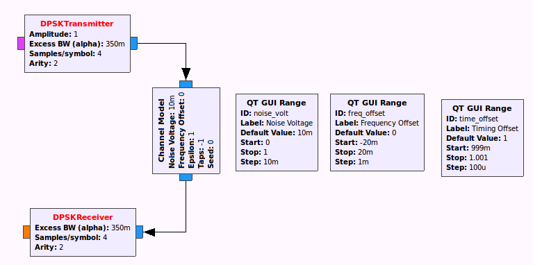

## gr-SatelliteModem - GNU Radio-based satelltie modem

**SatelliteModem** is a GNU Radio module that offers single-carrier satellite communications capablility. The module contains GNU Radio blocks which can be used to transmit and/or receive data over the air (eg. over satellite frequencies). Currently, the module supports differential BPSK and QPSK modulation, rate-1/2, 3/4 and 7/8 convolutional coding rates. A range of data rates can be achieved through use of different combination of modulations, coding rates and sampling rates.

## Installation
Before installing **SatelliteModem**, make sure that you have already installed the latest version Gnuradio. The module has been tested against Gnuradio v3.7.9. Any radio front-end can be used as long as it is supported by Gnuradio and has both TX and RX antenna ports. UHD-based example can be found in `examples/` folder. The module was created using Gnuradio templating engine called **gr_modtool** which automates creation of out-of-tree modules. The installation process follows standard CMake project installation.\\

	$ cd gr\_SatelliteModem
	$ mkdir build
	$ cd build 
	$ cmake ../ 
	$ make
	$ make test
	$ sudo make install

## Transceiver Design

### Modulation
Currently, supported modulation formats are Differencial BPSK (DBPSK) and Differential QPSK (DQPSK). The modulator converts data bytes (each byte contains 8 data-bits) into symbols. The number of bits per symbol is either 1 (for DBPSK) or 2 (for DQPSK). Then each of the symbols is mapped to one of the constellation points (complex symbols). Finally, the complex symbols are fed to a pulse-shaping filter. The filter is Root-Raised Cosine (RRC) filter, and exact replica of this filter is used at the receiver such that all the signal energy is coherently combined without causing Inter-Symbol interference (ISI). Figure below shows both the modulator and demodulator connected over a fading channel simulator. In practice, communication over a radio channel suffers from signal distortion caused by the propagation medium and hardware imperfections such as clock drift. For successful reception, the receiver has to compensate for such distortions. Oscillators used by the transmitter and the receiver are far from being ideal. A mismatch between these oscillators introduces carrier frequency offset and clock skew. Moreover, the receiver may receive multiple reflections of the transmitted signal each arriving at the receiver with slightly different delays and phases. Hence, the receiver has to adaptively compensate (equalize) for channel fading caused by such multi-path propagation. Once this is done, a matched-filter (RRC filter) is used to down-sample the signal and recover transmitted symbols. DPSK demodulator de-maps the complex symbols back to bits. Output of the demodulator is a stream of floating-point numbers, or **soft-bits**, (instead of hard-decision 1's and 0's). The magnitude of a **soft-bit** corresponds to the reliability of the demodulated bit. 

<figure>
	
</figure>

### Synchronization
Without a time-synchronization mechanism, the receiver is not able to identify the starting point of a data packet. Moreover, Viterbi decoder may not be able to decode the data. For example, assume that the coding rate is 3/4. This implies that, the channel encoder produces 4 bits for every 3 data bits where the 4 output bits are serial contatenated. The decoder, on the other hand, gropus received soft bits into a block of 4 consecutive soft bits. However, there are four possible starting points when grouping the soft bits. To solve these problems, a pseudo-random sequence of bits (**preamble**) which is known by both the transmitter and the receiver is appended to each transmitted packet. The receiver correlates received soft bits against the preamble sequence and marks the frame boundaries by looking at places where correlation peak is detected. **SatelliteModem** module comes with the following two blocks as shown in the figure below.

- `SyncPreamble` This block appends preamble bytes at the beginning of each encoded packet.
- `PreambleDetector` This block correlates soft bits against the preamble sequence. After detection of frame boundaries, **PreambleDetector** block removes the preamble bits and passes soft bits which belong to an encoded packet.

<figure>
	
</figure>

### Forward Error-Correcting Code (FEC)
Error-correcting codes such as Viterbi (convolutional) encoding add extra redundancy to transmited data such that the receiver is able to correct errornous bits. The coding rate determines the maximum number of errornous bits that can be corrected. **SatelliteModem**'s encoder supports two channel encoders: Viterbi and Low-Density Parity Check (LDPC) codes. Viterbi encoder can be configured to one of three coding rates: 1/2, 3/4 and 7/8. Currently, LDPC supports only one coding rate which is 0.42.

<figure>
	
</figure>

### Packet Encoder
Packet encoder serves two main functions. First, it packs stream of data bytes into blocks of fixed size. Secondly, each block, **frame/packet** is prepended with a 6-byte header as shown in the figure below.

<figure>
	
</figure>

A 16-bit CRC is added in order to detect errornous packets. **SatelliteModem** has two alternative packet encoder/decoder blocks. One of them is **Packetizer/Depacketizer**. These blocks are written in Python. The **Packetizer** block reads bytes from a UDP port and encodes them into packets. The size of UDP packets should not exceed **MTU**. In case, the size of a UDP packet is less than **MTU**, padding bytes are appended at the end. However, the CRC is computed only for the payload part excluding padding bytes. The **Depacketizer** block, on the other hand, validates the CRC header, and writes the payload into another UDP port. 

<figure>
	
</figure>

Alternatively, C++ based implementations, **Framer/Deframer**, can be used. These blocks do not access the UDP port directly. Instead, messaging blocks are used to connect **Framer/Deframer** with **UDP Source/UDP Sink** blocks. This isolation might help in reducing latency.

<figure>
	
</figure>

Note that both **Packetizer** and **Framer** have two modes of operation: **blocking** and **non-blocking**. In **blocking** mode, the transmitter is suspended until data is available at the UDP port. In **non-blocking** mode, a dummy packet is transmitted when there is no data transmit. This eliminates discontineous transmissions. During over-the-air operation, it is recommended to use **non-blocking** mode such that the receiver stays synchronized to the transmitter's clock.

## Examples

There are two example applications located in `examples/` folder. The first one is **transceiverLoopbackSimulator** which simulates both the transmitter and the receiver communicating over a fading channel. The second is **transceiverLoopbackUHD** that implements a complete transceiver when connected to UHD-compatible frontend. This application requires a radio front-end that is supported by a UHD driver. Make sure to set both TX and RX freqeuencies appropriately. The transceiver can be tested in **loopback** mode by using identical TX and RX frequencies.
